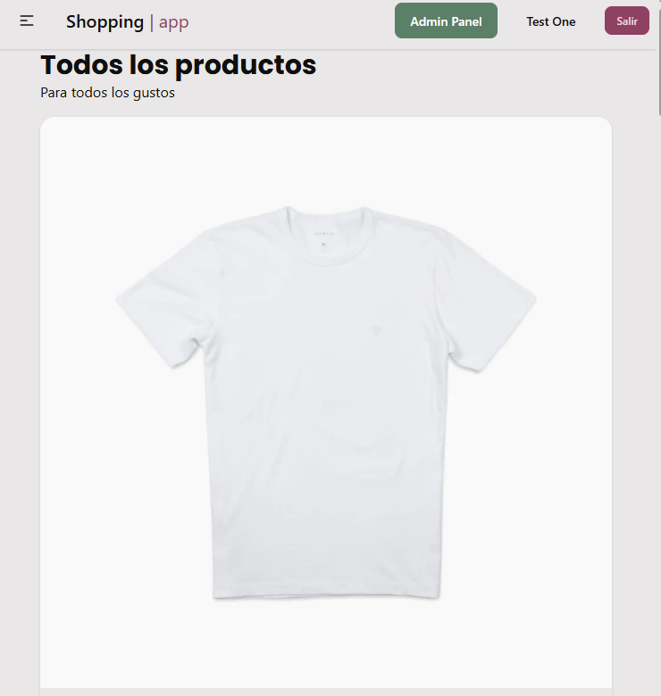
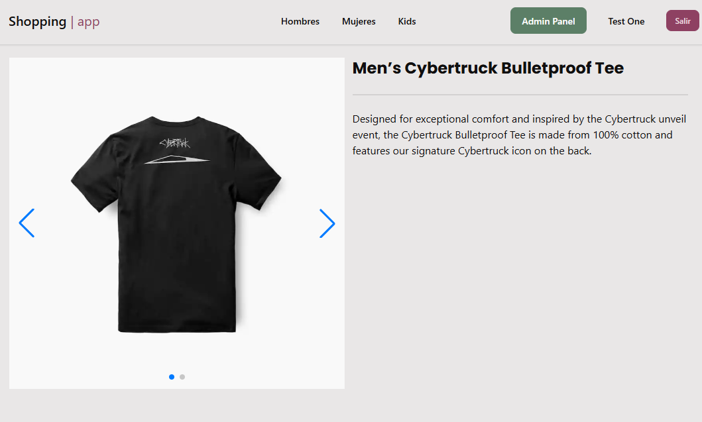

<div align="center">

# 🛍️ Shopping App Angular

Una aplicación de e-commerce desarrollada con Angular 19, que ofrece una experiencia de listado de productos con un sistema de gestión de productos para administradores.


</div><br>

## ✨ Características Principales

### 👥 Para Usuarios
- **Catálogo de Productos**: Explora una amplia variedad de productos organizados por categorías
- **Categorías por Género**: Navegación intuitiva separada por Hombres, Mujeres y Niños
- **Vista Detallada**: Información de cada producto con imágenes de alta calidad
- **Paginación Eficiente**: Sistema de paginación para una navegación fluida

### 🔐 Panel de Administración
- **Gestión Completa de Productos**: CRUD completo (Crear, Leer, Actualizar, Eliminar)
- **Carga de Imágenes**: Sistema de upload para imágenes de productos
- **Control de Acceso**: Acceso restringido solo para usuarios con rol de administrador

## 📸 Capturas

| | |
| ------------- |:-------------:|
|  |  |

## 🚀 Inicio Rápido

### Prerequisitos

Asegúrate de tener instalado:
- [Node.js](https://nodejs.org/) (versión 18 o superior)
- [Angular CLI](https://angular.io/cli) (versión 19.1.3)

```bash
npm install -g @angular/cli@19.1.3
```

### Instalación

1. **Clona el repositorio**
```bash
git clone https://github.com/baenat/shopping-app-angular.git
cd shopping-app-angular
```

2. **Instala las dependencias**
```bash
npm install
```

3. **Inicia el servidor de desarrollo**
```bash
ng serve
```

4. **Abre tu navegador**
Navega a `http://localhost:4200/` - La aplicación se recargará automáticamente al modificar archivos

## 📁 Estructura del Proyecto

```
shopping-app-angular/
├── src/
│   ├── app/
│   │   ├── admin/
│   │   │   ├── components/
│   │   │   ├── layouts/
│   │   │   ├── pages/
│   │   │   └── services/
│   │   ├── auth/
│   │   │   ├── guards/
│   │   │   ├── interceptors/
│   │   │   ├── interfaces/
│   │   │   ├── layout/
│   │   │   ├── pages/
│   │   │   └── services/
│   │   ├── products/
│   │   │   ├── components/
│   │   │   ├── interfaces/
│   │   │   ├── pipes/
│   │   │   └── services/
│   │   ├── store-front/
│   │   │   ├── components/
│   │   │   ├── layouts/
│   │   │   ├── pages/
│   │   ├── services/   
│   │   ├── utils/     
│   │   └── shared/  
│   ├── assets/  
│   └── environments/
├── angular.json
├── package.json
└── README.md
```

## 🛠️ Comandos

### Desarrollo
```bash
# Servidor de desarrollo
ng serve

# Servidor con puerto específico
ng serve --port 4300

# Abrir automáticamente en el navegador
ng serve --open
```

### Generación de Código
```bash
# Generar un nuevo componente
ng generate component nombre-componente

# Generar un servicio
ng generate service nombre-servicio

# Generar un guard
ng generate guard nombre-guard
```

### Build y Testing
```bash
# Compilar el proyecto
ng build

# Build de producción
ng build --configuration production
```

## 👤 Roles de Usuario

### Usuario Regular
- Navegar por el catálogo de productos
- Ver detalles de productos
- Filtrar por categorías (Hombres, Mujeres, Niños)
- Navegar entre páginas

### Administrador
Todas las funcionalidades de usuario regular, más:
- Acceso al panel de administración
- Crear nuevos productos
- Editar productos existentes
- Eliminar productos
- Cargar y gestionar imágenes de productos

## 🎨 Categorías

La aplicación organiza los productos en tres categorías principales:

- **👨 Hombres**: Productos para caballeros
- **👩 Mujeres**: Productos para damas
- **👶 Niños**: Productos infantiles

## 📦 Características Técnicas

- **Angular 19.1.3**: Framework principal
- **TypeScript**: Lenguaje de programación
- **Lazy Loading**: Carga perezosa de módulos
- **Reactive Forms**: Formularios reactivos para el panel admin
- **Route Guards**: Protección de rutas administrativas
- **Responsive Design**: Adaptable a diferentes dispositivos
- **Optimización**: Build optimizado para producción

## 🔒 Seguridad

- Autenticación basada en roles
- Rutas protegidas con Guards

## 📝 Licencia

Este proyecto está bajo la Licencia MIT - ver el archivo [LICENSE](LICENSE) para más detalles.

## 📧 Contacto

**Desarrollador**: [baenat](https://github.com/baenat)

**Repositorio**: [shopping-app-angular](https://github.com/baenat/shopping-app-angular)

---

Hecho con ❤️ usando Angular
